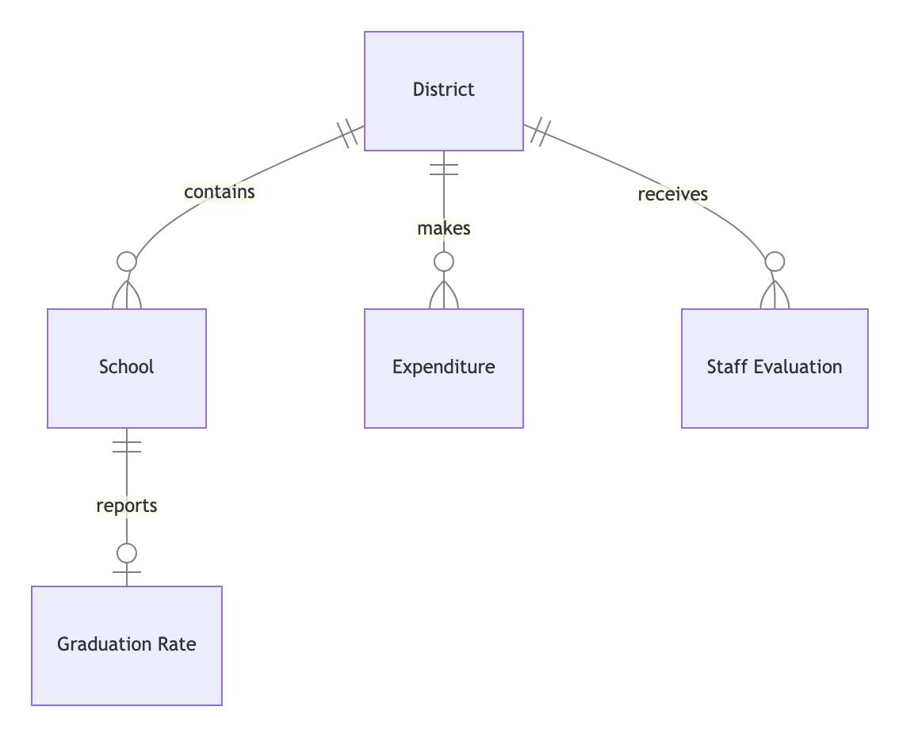

    

## District - School
- One *district* contains zero or many *schools*
- One *school* can belong to exactly one *district*

## District - Expenditure
- One *district* makes zero or many *expenditures*
- One *expenditure* can belong to exactly one *district*

## District - Staff Evaluation
- One *district* receives zero or many *staff evaluations*
- One *staff evaluation* can belong to exactly one *district*

## School - Graduation Rate
- One *school* reports zero or one *graduation rates*
- One *graduation rate* can belong to exactly one *school*
