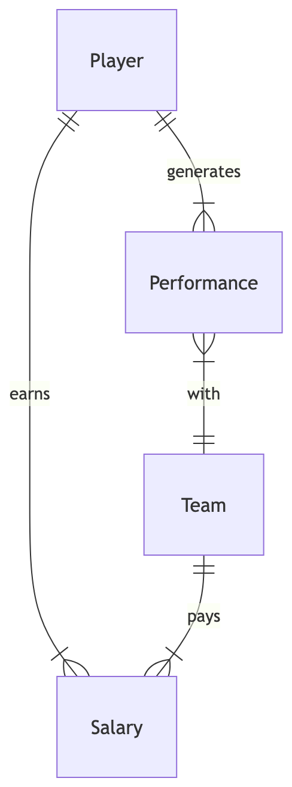

    

## Player - Performance
- Exactly one player generates one or many performance(s)
- One or many performance(s) is/are generated by exactly one player

## Player - Salary
- Exactly one player earns one or many salaries
- One or many salaries are earned by exactly one player

## Performance - Team
- One or many performance(s) is/are linked with exactly one team
- One team can have one or many performance(s)

## Team - Salary
- Exactly one team pays one or many salaries
- One or many salaries is paid for by exactly one team
