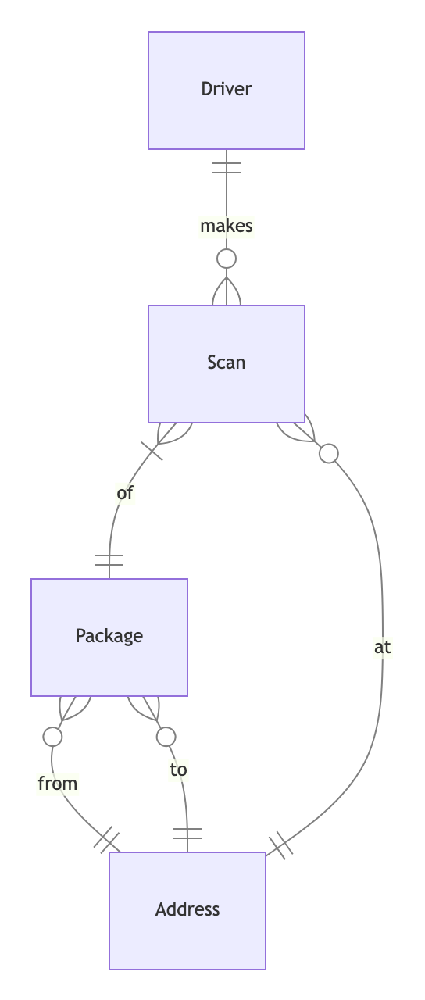

    

## Driver - Scan
- One driver makes zero or multiple scans
- Zero or multiple scans are made by exactly one driver

## Scan - Package
- Exactly one package can have one or many scans

## Scan - Address
- Zero or many scans can be done at exactly one address
- One address can have zero or many scans

## Package - Address
- Zero or many packages have exactly one from address
- Zero or many packages have exactly one to address
