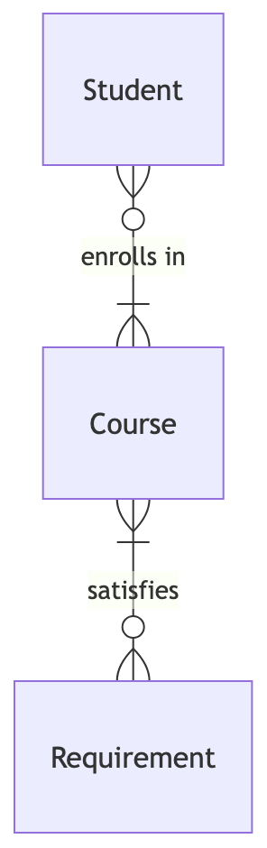

# 🏫 your.harvard

## Problem to Solve

If you’re not already familiar, Harvard has a course shopping tool called my.harvard, with which students explore (and ultimately register for!) classes. To keep track of courses, students, and their registrations, my.harvard presumably uses some kind of underlying database. And yet, if you’ve ever used it, you’ll know that my.harvard isn’t especially… quick.

Here’s your chance to make my.harvard just a little bit faster! In this problem, take some Harvard course data and create indexes to speed up typical queries on the database. Keep in mind that indexing every column isn’t always the best solution: you’ll need to consider trade-offs in terms of space and time, ultimately representing Harvard’s courses and students in the most efficient way possible.

## Distribution Code

For this problem, you’ll need to download `harvard.db` and an `indexes.sql` file in which you’ll write your SQL statements to create your indexes.

```zsh
wget https://cdn.cs50.net/sql/2024/x/psets/5/harvard.zip
```

## Schema

<p align="center">
    
</p>

Within `harvard.db`, you’ll find five tables that implement the relationships described in the ER diagram above.

### `students` table

- `id`, which is the student’s ID.
- `name`, which is the student’s name.

### `courses` table

- `id`, which is the courses’s ID.
- `department`, which is the department in which the course is taught (e.g., “Computer Science”, “Economics”, “Philosophy”).
- `number`, which is the course number (e.g., 50, 12, 330).
- `semester`, which is the semester in which the class was taught (e.g., “Spring 2024”, “Fall 2023”).
- `title`, which is the title of the course (e.g., “Introduction to Computer Science”).

### `enrollments` table

- `id`, which is the ID to identify the enrollment.
- `student_id`, which is the ID of the student enrolled.
- `course_id`, which is the ID of the course in which the student is enrolled.

### `requirements` table

- `id`, which is the ID of the requirement.
- `name`, which is the name of the requirement.

### `satisfies` table

- `id`, which is the ID of the course-requirement pair.
- `course_id`, which is the ID of a given course.
- `requirement_id`, which is the ID of the requirement which the given course satisfies.

## Specification

In `indexes.sql`, write a set of SQL statements that create indexes which will speed up typical queries on the `harvard.db` database. The number of indexes you create, as well as the columns they include, is entirely up to you. Be sure to balance speed with disk space, only creating indexes you need.

When engineers optimize a database, they often care about the typical queries run on the database. Such queries highlight patterns with which a database is accessed, thus revealing the best columns and tables on which to create indexes. Below explains the set of typical `SELECT` queries run on `harvard.db`.

### Typical SELECT queries on harvard.db

- Find a student’s historical course enrollments, based on their ID:

```sql
SELECT "courses"."title", "courses"."semester"
FROM "enrollments"
JOIN "courses" ON "enrollments"."course_id" = "courses"."id"
JOIN "students" ON "enrollments"."student_id" = "students"."id"
WHERE "students"."id" = 3;
```

- Find all students who enrolled in Computer Science 50 in Fall 2023:

```sql
SELECT "id", "name"
FROM "students"
WHERE "id" IN (
    SELECT "student_id"
    FROM "enrollments"
    WHERE "course_id" = (
        SELECT "id"
        FROM "courses"
        WHERE "courses"."department" = 'Computer Science'
        AND "courses"."number" = 50
        AND "courses"."semester" = 'Fall 2023'
    )
);
```

- Sort courses by most- to least-enrolled in Fall 2023:

```sql
SELECT "courses"."id", "courses"."department", "courses"."number", "courses"."title", COUNT(*) AS "enrollment"
FROM "courses"
JOIN "enrollments" ON "enrollments"."course_id" = "courses"."id"
WHERE "courses"."semester" = 'Fall 2023'
GROUP BY "courses"."id"
ORDER BY "enrollment" DESC;
```

- Find all computer science courses taught in Spring 2024:

```sql
SELECT "courses"."id", "courses"."department", "courses"."number", "courses"."title"
FROM "courses"
WHERE "courses"."department" = 'Computer Science'
AND "courses"."semester" = 'Spring 2024';
```

- Find the requirement satisfied by “Advanced Databases” in Fall 2023:

```sql
SELECT "requirements"."name"
FROM "requirements"
WHERE "requirements"."id" = (
    SELECT "requirement_id"
    FROM "satisfies"
    WHERE "course_id" = (
        SELECT "id"
        FROM "courses"
        WHERE "title" = 'Advanced Databases'
        AND "semester" = 'Fall 2023'
    )
);
```

- Find how many courses in each requirement a student has satisfied:

```sql
SELECT "requirements"."name", COUNT(*) AS "courses"
FROM "requirements"
JOIN "satisfies" ON "requirements"."id" = "satisfies"."requirement_id"
WHERE "satisfies"."course_id" IN (
    SELECT "course_id"
    FROM "enrollments"
    WHERE "enrollments"."student_id" = 8
)
GROUP BY "requirements"."name";
```

- Search for a course by title and semester:

```sql
SELECT "department", "number", "title"
FROM "courses"
WHERE "title" LIKE "History%"
AND "semester" = 'Fall 2023';
```

## Advice

In this problem, you’ll take the opposite perspective you did while working on In a Snap: rather than design a query that takes advantage of existing indexes, your task is to design indexes which existing queries can take advantage of.

### Use `EXPLAIN QUERY PLAN` on each `SELECT` query to assess where best to create indexes

Begin by assessing where best to create indexes by understanding the plan for each typical query on my.harvard’s database.

For example, try revealing the plan for the first typical query, as by executing the following:

```sql
EXPLAIN QUERY PLAN
SELECT "courses"."title", "courses"."semester"
FROM "enrollments"
JOIN "courses" ON "enrollments"."course_id" = "courses"."id"
JOIN "students" ON "enrollments"."student_id" = "students"."id"
WHERE "students"."id" = 3;
```

The output of the above is as follows:

```sql
QUERY PLAN
|--SEARCH students USING INTEGER PRIMARY KEY (rowid=?)
|--SCAN enrollments
`--SEARCH courses USING INTEGER PRIMARY KEY (rowid=?)
```

Notice that, while the database engine is already `SEARCH`ing the students and courses tables using their primary key indexes, there are still improvements to be made: the database engine is `SCAN`ning the enrollments table without an index. Recall that to `SCAN` means that the database engine must search through all rows, one by one—a process that is much slower than searching an index!

Experiment now by creating an index which could turn that `SCAN` into a `SEARCH` that uses an index. Then, repeat the same process for each of the typical queries on my.harvard’s database until you’ve arrived at a set of indexes which ensure all queries are using indexes to their full potential.

### Minimize the number of indexes you've created

Keep in mind that indexes take up additional space, and that they can slow `INSERT`, `UPDATE`, and `DELETE` queries. Once you’ve arrived at an initial set of indexes, start paring them down until you’ve created the minimum required for each query to use indexes optimally. How to start this process? Consider the following questions:

1. Do any of your indexes include the same columns? If so, it’s likely you need only one index on that particular column.
2. Do any of your indexes include columns unused by the given queries? If so, it’s likely you can remove those columns from your indexes.
3. Does removing an index have any impact on each query’s plan? If not, might be best to remove it!

Through the iterative process above, you’ll refine the indexes you’ve chosen to create.

## Usage

To load your indexes as you write them in `indexes.sql`, you can use

```sql
.read indexes.sql
```

Keep in mind you can also use

```sql
DROP INDEX name;
```

where `name` is the name of your index, to remove an index before creating it anew.

You may want to use `VACUUM` to free up disk space after you delete an index!
